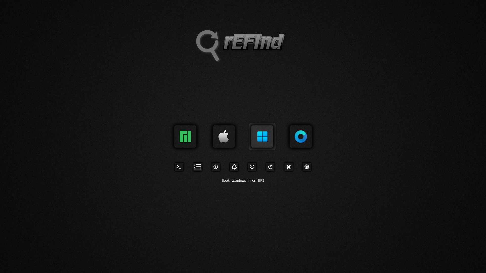
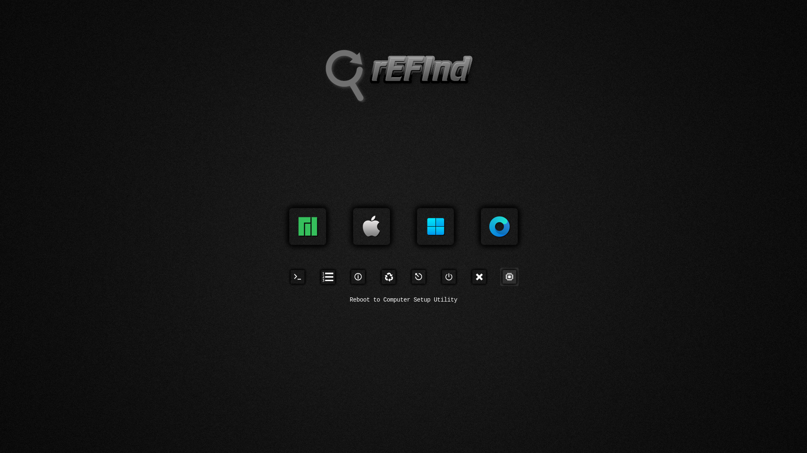

# Shadow-rEFInd
- Icon Set use with [rEFInd](https://www.rodsbooks.com/refind/) and  [rEFIndPlus](https://github.com/dakanji/RefindPlus)
  
- ### 87 Distro Icons DarkGrey Square

View ➤ [Ison Set](https://github.com/chris1111/Shadow-rEFInd/blob/main/View-Set.md)
View ➤ [All Icons](https://github.com/chris1111/Shadow-rEFInd/tree/main/Shadow-rEFInd)

Configuration ➤ [Refind config](https://github.com/chris1111/Shadow-rEFInd/blob/main/refind-Icon-Set-DarkGrey-Refind.conf)

Download Icons Set ➤ [Shadow-rEFInd.zip](https://github.com/chris1111/Shadow-rEFInd/raw/refs/heads/main/Shadow-rEFInd.zip)

### rEFInd

### rEFIndPlus

 
