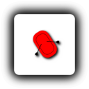
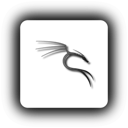
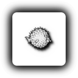
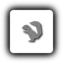

## View Set Shadow-rEFInd

 



























































































### Banner

[Back On ➦ Top](https://github.com/chris1111/Shadow-rEFInd/blob/main/View-Set.md#view-set)
